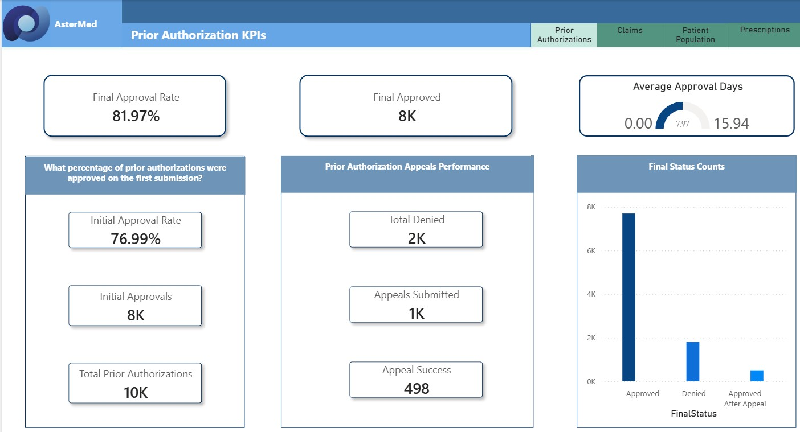
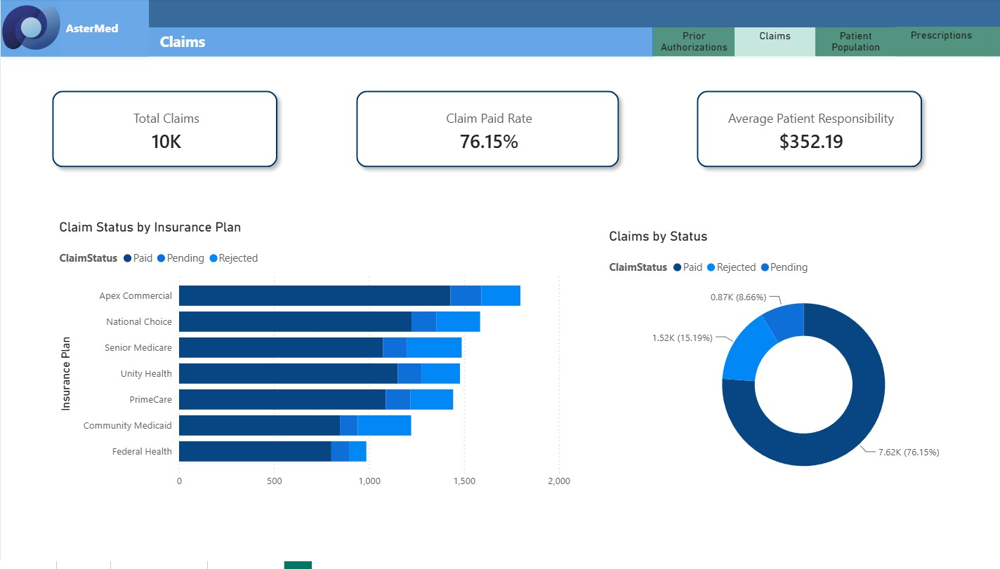
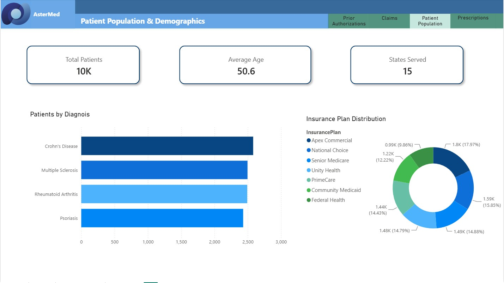
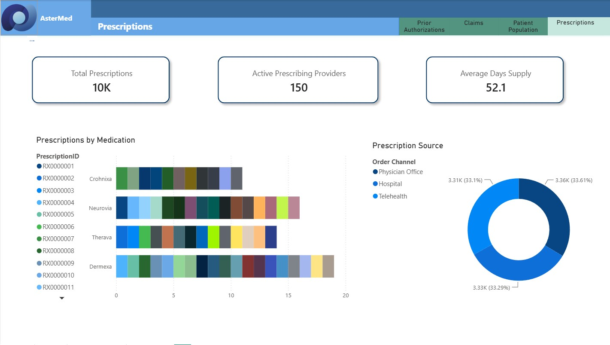

# 🏥 Patient Access Analytics Platform

### End-to-End Healthcare Analytics Project | Python • SQL Server • Power BI • Data Quality • Business Intelligence

## Project Overview

This project simulates a real-world **Patient Access & Support Services (PASS)** analytics environment similar to those used by healthcare analytics organizations. It demonstrates the complete analytics lifecycle—from data generation and validation to business intelligence reporting and executive dashboards.

The project follows a realistic patient journey through the specialty medication access process:

**Patient Enrollment → Prescription → Prior Authorization → Insurance Claim → Patient Support Program → Pharmacy Fulfillment**

Rather than focusing only on dashboard development, this project emphasizes enterprise analytics practices including data quality, business rules, SQL development, documentation, KPI design, and stakeholder-focused reporting.

# Dashboard Preview

| Prior Authorization KPIs Dashboard | Claims Dashboard |
|----------------------|-------------------------------|
|  |  |

| Patient Population & Demographics Dashboard | Prescriptions Dashboard |
|---------------------------|------------------------------|
|  |  |

---

# Business Objective

---

# Business Objective

Healthcare organizations need to understand where delays occur in the patient access process and identify opportunities to improve patient outcomes.

This project answers questions such as:

- Which insurance plans have the highest prior authorization denial rates?
- Which providers experience the longest approval times?
- How long does it take for patients to receive therapy?
- Which pharmacies have the longest fulfillment delays?
- Does participation in patient support programs improve outcomes?
- What factors contribute most to delays in patient access?

---

# Project Goals

- Generate realistic healthcare data using Python
- Build a relational SQL database
- Validate data quality using automated Python scripts
- Create reusable SQL queries for business analysis
- Develop executive Power BI dashboards
- Document the complete analytics solution
- Demonstrate enterprise Business Intelligence best practices

---

# Technology Stack

| Technology | Purpose |
|------------|---------|
| Python | Data generation, ETL, validation |
| SQL Server | Database development and business queries |
| Power BI | Executive dashboards and reporting |
| Excel | Data dictionary and validation |
| Git / GitHub | Version control |
| Markdown | Project documentation |

---

# Repository Structure

```
Patient-Access-Analytics-Platform
│
├── Data
│   ├── patients.csv
│   ├── providers.csv
│   ├── prescriptions.csv
│   ├── prior_authorizations.csv
│   ├── claims.csv
│   ├── support_programs.csv
│   └── pharmacy_fulfillment.csv
│
├── Python Scripts
│   ├── Claims.py
│   ├── Patients.py
│   ├── Pharmacy_Fulfillment.py
│   ├── Prescriptions.py
│   ├── Prior_Authorizations.py
│   ├── Providers.py
│   ├── Support_Programs.py

│
├── SQL
│   ├── BULK INSERT Patients.sql
│   ├── CREATE TABLE Patients.sql
│   ├── DATA VALIDATION.sql
│   ├── Exploratory Analysis.sql
│   ├── Insurance Plans Highest Denial Rate.sql
│   ├── KPI Query.sql
│   ├── Missing Providers.sql
│   ├── Orphan Claims.sql
│
├── Power BI
│
├── Documentation
│   ├── Approved Values
│   ├── Claims
│   ├── Current Patient Journey
│   ├── Current Relationship Diagram
│   ├── Data Dictionary Structure
│   ├── Data Dictionary
│   ├── Patient_Access_Data_Dictionary
│   ├── Pharmacy Fulfillment
│   ├── Prescriptions
│   ├── Prior Authorizations
│   ├── Providers
│   ├── Relationship Inventory
│   ├── Support Programs
│   ├── Validation Log
│   ├── Validation Process
│   ├── Validation Report
│
└── README.md
```

---

# Data Model

The project models the complete patient access workflow using related datasets.

```
Patients
    │
    ├── Support Programs
    │
    └── Prescriptions
            │
            ├── Providers
            │
            └── Prior Authorizations
                    │
                    └── Claims
                            │
                            └── Pharmacy Fulfillment
```

---

# Skills Demonstrated

### Business Intelligence

- KPI Development
- Executive Reporting
- Dashboard Design
- Data Visualization
- Trend Analysis

### SQL

- Joins
- Common Table Expressions (CTEs)
- Window Functions
- Views
- Stored Procedures
- Data Validation
- Business Reporting

### Python

- Synthetic Data Generation
- ETL Automation
- Data Validation
- Data Quality Reporting
- CSV Processing

### Data Management

- Relational Data Modeling
- Data Governance
- Data Dictionary Creation
- Referential Integrity
- Business Rule Validation

---

# Example Business KPIs

- Prior Authorization Approval Rate
- Appeal Success Rate
- Average Days to Approval
- Average Time to Therapy
- Average Patient Out-of-Pocket Cost
- Claim Approval Rate
- Pharmacy Fulfillment Time
- Delivery Delay Rate
- Patient Support Enrollment
- Financial Assistance Utilization

---

# Project Highlights

✔ End-to-end analytics workflow

✔ Realistic healthcare business scenario

✔ Enterprise-style documentation

✔ Automated data validation

✔ SQL business reporting

✔ Executive Power BI dashboards

✔ Data governance best practices

---

# Future Enhancements

Future versions of this project may include:

- Microsoft Fabric implementation
- Snowflake data warehouse
- Incremental ETL pipelines
- Power BI deployment pipelines
- Git-integrated PBIP project structure
- AI-assisted reporting
- Predictive analytics for patient access delays

---

# About This Project

This portfolio project was created to demonstrate practical Business Intelligence and Data Analytics skills using a realistic healthcare use case. The focus is on solving business problems through high-quality data, analytics, and reporting rather than simply building dashboards.

The project reflects the type of end-to-end analytical workflow commonly performed by Business Intelligence and Data Analysts supporting healthcare operations, patient access programs, and executive decision-making.
